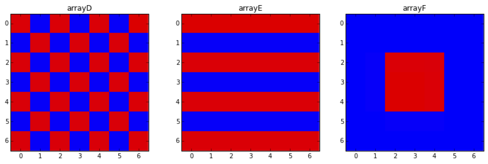

# Materials Science - Introduction

This repository introduces **Materials Science** concepts through **Python**. Specifically, it demonstrates how structured arrays can be created and visualized to represent different materials or patterns, providing insights into their structural behavior. We use Python libraries such as **NumPy** and **Matplotlib** for array manipulation and visualization.

## Table of Contents

1. [Introduction](#introduction)
2. [Checkerboard and Structured Arrays](#checkerboard-and-structured-arrays)
3. [Example Arrays](#example-arrays)
4. [Getting Started](#getting-started)
5. [Installation](#installation)
6. [Contributing](#contributing)
7. [License](#license)

---

## Introduction

This repository serves as an introductory guide to how arrays and patterns can be used to represent and simulate material structures in **Materials Science**. Arrays form the foundation for understanding atomic or molecular structures and periodicity in materials.

By the end of this module, you will:
- Understand how to generate structured arrays in Python.
- Learn to visualize 2D and 3D arrays that mimic common material patterns.
- Gain experience in using `NumPy` and `Matplotlib` for scientific computing and visual representation.

## Checkerboard and Structured Arrays

Structured arrays are commonly used in materials science to represent periodic patterns or arrangements, such as atoms in a crystal lattice or alternating phases in a composite material. Some common patterns include checkerboards, stripes, and centered arrays.

In this repository, you will explore the following array patterns:

1. **Checkerboard pattern**: This is useful for representing alternating material components, like a simple binary alloy structure.
2. **Striped pattern**: These arrays can represent layered materials, with alternating stripes corresponding to different layers.
3. **Centered block pattern**: This represents a core-shell structure, often used for representing particles embedded in a matrix.

## Example Arrays

Below are visual representations of several array patterns that are useful for modeling different material structures:



- **arrayD**: A checkerboard pattern, typically used to visualize alternating atoms in a binary structure.
- **arrayE**: A striped pattern, representing a layered material.
- **arrayF**: A centered pattern, often used for core-shell structures, where the red core is embedded in a blue matrix.

These visualizations provide an intuitive understanding of how materials can be represented as periodic or structured arrays in a computational environment.

## Getting Started

### Prerequisites

To run the array simulations and visualizations, you will need:

- Python 3.x
- `NumPy` for array manipulations
- `Matplotlib` for visualizing arrays
- Jupyter Notebook (optional, for running `.ipynb` files)

### Installation

1. Clone the repository to your local machine:

   ```bash
   git clone https://github.com/smahala02/Materials-Science-Introduction.git
   ```

2. Install the required Python packages:

   ```bash
   pip install numpy matplotlib
   ```

3. If you want to run the notebook file:

   ```bash
   jupyter notebook 'Introduction to Python for Materials Science.ipynb'
   ```

## Contributing

Contributions to this repository are welcome! If you have ideas for new array patterns or material simulations, feel free to open a pull request:

1. Fork the repository.
2. Create a new branch (`git checkout -b new-feature`).
3. Commit your changes (`git commit -m 'Add new feature'`).
4. Push to the branch (`git push origin new-feature`).
5. Open a pull request.

## License

This repository is licensed under the MIT License. See the `LICENSE` file for more information.
